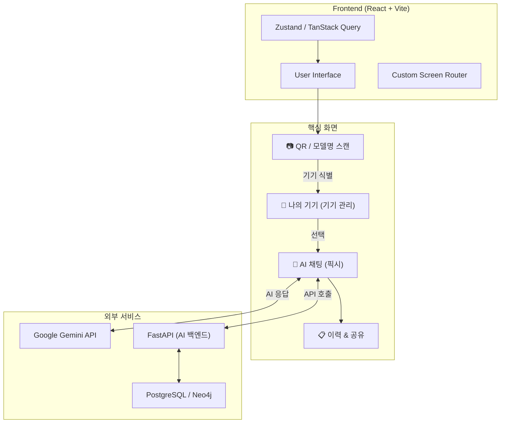

# Fixie (Easy Manual) — Frontend 🔧

<div align="center">
  
  
  
  
  <br/>
  
  
  
  <br/><br/>

  
  
  
  <br/><br/>

  <a href="https://github.com/asd9244/Easy_Manual/tree/deploy/azure-setup">
    
  </a>
  <a href="https://github.com/asd9244/Easy_Manual">
    
  </a>
  <a href="https://www.notion.so/334df1d0a347808d9b97f37da0419915">
    
  </a>
</div>

---

## 💡 서비스 소개

> 가전제품 매뉴얼은 두꺼운 종이에 빽빽한 글씨로 가득합니다.  
> 정작 필요한 정보를 찾으려면 한참을 뒤져야 하죠.

**Fixie**는 복잡한 가전 매뉴얼을 AI로 재구조화하여, QR 스캔 한 번으로 나만의 AI 전문가 '픽시'와 대화하며 제품을 마스터할 수 있는 서비스입니다.

---

## 👤 역할 및 기여

> **담당**: 기획 · UI/UX 설계 · 프론트엔드 개발 · 배포

서비스 구성을 기획하고 페이지 구조와 레이아웃을 설계한 뒤, 백엔드 팀원에게 필요한 API를 정리해 전달하며 협업했습니다. AI와 백엔드는 팀원이 담당했고, 그 결과물이 사용자에게 자연스럽게 닿을 수 있도록 **인터페이스를 만드는 데 집중**했습니다.

가장 어려웠던 건 기술이 아니라 **속도**였습니다. 빠르게 기능을 쌓아가는 스타일이 팀원에게 부담이 되었고, 그걸 알아차린 후부터는 자주 회의하고 슬랙으로 실시간 소통하며 서로의 속도를 맞춰갔습니다. 협업에서 가장 중요한 건 결국 **사람**이라는 걸 배운 프로젝트였습니다.

---

## 🏗️ 서비스 아키텍처 (Architecture)



---

## ✨ 주요 기능 (Features)

### 1. 📷 스마트 기기 스캔 (Scan)
- **QR 및 모델명 인식**: 카메라를 통해 제품의 QR 코드나 모델명을 즉시 인식합니다.
- **자동 기기 매칭**: 인식된 정보를 바탕으로 데이터베이스에서 해당 제품을 찾아 즉시 연결합니다.

### 2. 🚗 나의 기기 (Garage)
- **기기 등록 및 관리**: 내가 보유한 가전제품, 전자기기 등을 등록하여 한곳에서 관리할 수 있습니다.
- **별칭 설정**: "거실 공기청정기", "내 방 모니터" 등 나만의 이름으로 기기를 관리하세요.

### 3. 💬 AI 인터랙티브 채팅 (Chat)
- **전문가급 답변**: Google Gemini AI 기반으로 매뉴얼을 이해한 AI '픽시'가 답변해 드립니다.
- **멀티모달 지원**: 텍스트뿐만 아니라 제품 사진을 찍어 보내면 상태를 분석하고 해결 방법을 제시합니다.
- **채팅 공유**: 유용한 답변은 공유 링크로 다른 사람과 쉽게 나눌 수 있습니다.

### 4. 🎨 개인화 테마 (Themes)
- **다양한 스타일**: 사용자의 취향에 맞는 다양한 시각적 테마를 제공합니다.
- **반응형 디자인**: 모바일(하단 탭바)과 데스크탑(좌측 사이드바) 환경 모두 최적화된 UX를 제공합니다.

---

## 📦 설치 및 실행 (Getting Started)

### 필수 요구 사항
- Node.js (v18 이상 권장)
- npm

### 설치
```bash
npm install
```

### 환경 변수 설정
`.env.example` 파일을 복사하여 `.env` 파일을 생성하세요.
```env
VITE_API_BASE_URL=백엔드_주소
VITE_GEMINI_API_KEY=Gemini_API_키
```

### 개발 서버 실행
```bash
npm run dev
# http://localhost:3000 에서 확인
```

---

## 📂 폴더 구조 (Directory Structure)

```text
src/
├── api/          # API 통신 로직 및 서비스 레이어
├── components/   # 공통 재사용 컴포넌트
├── constants/    # 설정 값 및 고정 데이터
├── pages/        # 주요 화면 (Home, Chat, Scan, Garage 등)
├── services/     # 비즈니스 로직 및 외부 서비스 연동
├── store/        # Zustand 전역 상태 저장소
├── types/        # TypeScript 타입 정의
└── utils/        # 공용 유틸리티 함수
```

---

## 📄 라이선스 (License)
이 프로젝트는 개인 학습 및 포트폴리오용으로 제작되었습니다.
