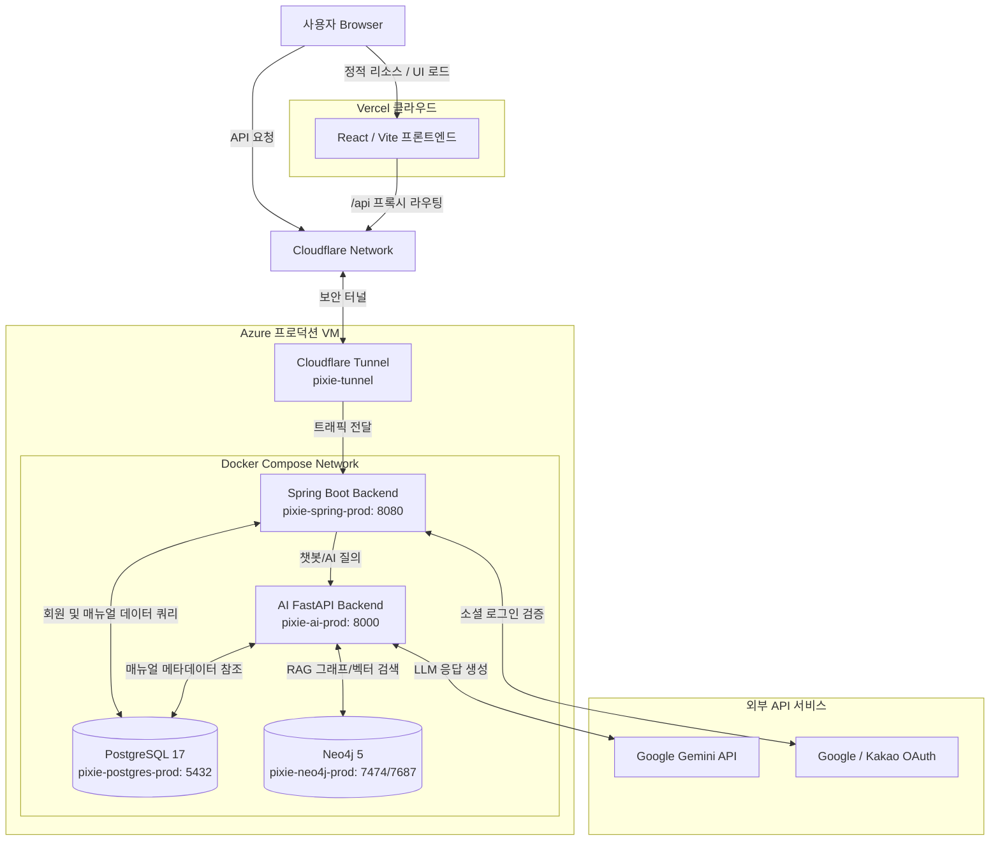

# Fixie (Easy_Manual) Azure 배포 가이드

이 문서는 Fixie(Easy_Manual) 서비스를 **Azure 환경**에 프로덕션 수준으로 배포하기 위한 가이드입니다. `deploy/azure-setup` 브랜치의 구성을 기준으로 작성되었습니다.

## 🏗️ 아키텍처 개요
- **Frontend**: Vercel 호스팅 (Vercel `vercel.json`을 통한 프록시 라우팅 지원)
- **Backend (Spring Boot)**: Azure VM 내 Docker Container
- **AI Backend (FastAPI)**: Azure VM 내 Docker Container
- **Database**: PostgreSQL 17 (사용자, 매뉴얼 메타데이터)
- **Vector DB**: Neo4j 5 (RAG 파이프라인 그래프 및 벡터 데이터베이스)
- **Network / Security**: Cloudflare Tunnel (`cloudflared`)을 활용하여 공인 IP 포트 개방 없이 안전한 HTTPS 연결 및 도메인 매핑 제공

### 아키텍처 다이어그램 (Mermaid)


## 📋 사전 준비 (Prerequisites)
1. **Azure VM**: Docker 및 Docker Compose가 설치된 Linux VM (Ubuntu 등 권장)
2. **Cloudflare**: Cloudflare Zero Trust 대시보드에서 생성한 Tunnel Token
3. **Vercel**: 프론트엔드 호스팅 및 배포를 위한 Vercel 프로젝트 세팅
4. **API Keys**: Google OAuth, Kakao OAuth, Gemini API KEY 등 필요

## 🚀 배포 단계 (Deployment Steps)

### 1. 레포지토리 클론 및 브랜치 전환
Azure VM의 터미널에서 다음 명령어를 실행하여 소스코드를 가져옵니다.
```bash
git clone https://github.com/asd9244/Easy_Manual.git
cd Easy_Manual
git checkout deploy/azure-setup
```

### 2. 환경 변수 설정 (`.env`)
프로젝트 루트 디렉토리에 `.env` 파일을 생성하고 다음 변수들을 기입합니다.
*(주의: 보안상 `.env` 파일은 절대 깃허브에 커밋되지 않도록 해야 합니다.)*

```env
# Database Settings
DB_USERNAME=postgres
DB_PASSWORD=your_db_password
DB_NAME=pixie
DB_URL=jdbc:postgresql://postgres:5432/pixie

# Neo4j Settings
NEO4J_USER=neo4j
NEO4J_PASSWORD=your_neo4j_password

# Security & JWT
JWT_SECRET=your_super_secret_jwt_key
JWT_EXPIRATION=86400000

# OAuth2 Settings (Social Login)
GOOGLE_CLIENT_ID=your_google_id
GOOGLE_CLIENT_SECRET=your_google_secret
KAKAO_CLIENT_ID=your_kakao_id
KAKAO_CLIENT_SECRET=your_kakao_secret

# AI Settings (Gemini 2.0 Flash 등 모델 사용)
GOOGLE_API_KEY=your_gemini_api_key

# Network Settings
FRONTEND_URL=https://your-vercel-domain.vercel.app
CLOUDFLARE_TUNNEL_TOKEN=your_cloudflare_tunnel_token
```

### 3. Docker Compose 빌드 및 컨테이너 실행
프로덕션용 `docker-compose.prod.yml` 파일을 사용하여 모든 서비스를 컨테이너로 백그라운드 실행합니다.

```bash
docker-compose -f docker-compose.prod.yml up -d --build
```

#### 배포되는 컨테이너 목록:
- `pixie-postgres-prod`: RDBMS 영속성 제공 (5432)
- `pixie-neo4j-prod`: 벡터 및 그래프 DB (7474, 7687)
- `pixie-spring-prod`: 메인 비즈니스 로직, 회원가입/인증 (8080)
- `pixie-ai-prod`: AI 챗봇 API 서버, RAG 검색 및 LLM 연동 (8000)
- `pixie-tunnel`: Cloudflare Tunnel 클라이언트 (인바운드 포트 포워딩 없이 안전하게 노출)

### 4. 프론트엔드 배포 (Vercel)
프론트엔드는 `em-project/frontend` 디렉토리를 Vercel에 연동하여 배포합니다.
- **Framework Preset**: Vite
- **Build Command**: `npm run build`
- **Output Directory**: `dist`
- **환경 변수**: Vercel 대시보드에 프로덕션용 환경 변수들(백엔드 도메인 등) 등록 필요

### 5. 매뉴얼 (AI 데이터) 동기화 안내
로컬이나 초기 세팅 시 작업해둔 RAG 메타데이터 및 이미지 파일이 Azure VM 서버에도 필요할 수 있습니다.
- `em-project/ai-backend/data/processed_images` 경로에 추출된 매뉴얼 이미지들이 위치해야 AI 서버가 이미지 프록시로 응답할 수 있습니다.
- 초기 구축 시 Neo4j에 문서를 벡터라이즈하여 적재하는 과정이 필요할 수 있습니다.

## 🛠️ 유지 보수 명령어

- **실시간 로그 확인**: 
  ```bash
  # 스프링 부트 로그 보기
  docker logs -f pixie-spring-prod
  
  # AI 서버 로그 보기
  docker logs -f pixie-ai-prod
  ```
- **서비스 재시작**: 
  ```bash
  docker-compose -f docker-compose.prod.yml restart
  ```
- **컨테이너 업데이트**: 코드 변경 후 변경 사항을 반영하려면 다시 빌드합니다.
  ```bash
  docker-compose -f docker-compose.prod.yml up -d --build
  ```
