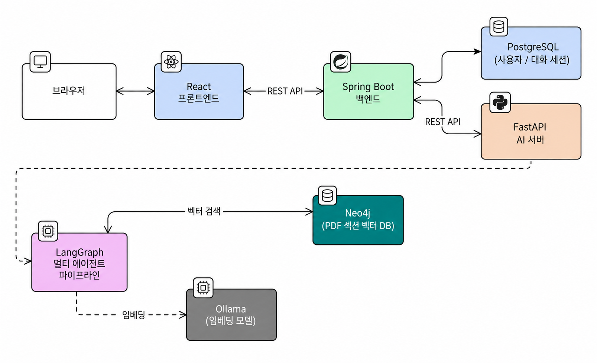

# Fixie (Easy Manual): 제조사 매뉴얼 AI Q&A 시스템

## **1. 프로젝트 개요 (Project Overview)**

- 기획 배경: 가전제품 매뉴얼은 분량이 많고 PDF로 흩어져 있어, 사용자가 “지금 이 기기”에 맞는 답을 찾기까지 시간이 오래 걸립니다. 그 결과 사용자는 매뉴얼 대신 고객센터·검색에 먼저 의존하게 되고, 제조사 입장에서는 동일한 문의가 반복적으로 누적되는 비효율이 발생합니다.
- 프로젝트 목표: 가전제품 매뉴얼 PDF를 **기기 모델 단위로 지식 DB(Neo4j + 벡터)에 적재**하고, 사용자가 등록한 기기의 스코프 안에서만 AI 챗봇이 질의를 처리하도록 합니다. Spring Boot는 사용자·기기·채팅 기록·인증 같은 비즈니스 API를 담당하고, FastAPI + LangGraph는 RAG 검색·멀티 에이전트 라우팅·임베딩 등 AI 처리를 담당합니다. PDF → 이미지 → OCR + 비전 분석 → TOC 기반 섹션 분할 → 벡터 임베딩 → Neo4j 적재 파이프라인을 별도 스크립트로 분리해, 매뉴얼 데이터를 **재현 가능한 절차**로 쌓을 수 있게 구성했습니다.

 

## **2. 기술 스택 (Tech Stack)**

- Infra & Run (로컬 · 컨테이너)

| Category | Detail |
| --- | --- |
| Container | **Docker**, **Docker Compose** (6컨테이너 단일 명령 실행) |
| DB | **PostgreSQL 18** (앱 데이터 + LangGraph 체크포인트), **Neo4j 5** (그래프 + 벡터 검색) |
| LLM / 임베딩 (로컬) | **Ollama** — 임베딩 `bge-m3`, 답변·Router LLM `gemma4:e4b` |
| LLM (외부) | **Gemini API** (PDF 페이지 비전 분석) |
| 포트 | Vite **3000**, Spring **8080**, FastAPI **8000**, Postgres **5432**, Neo4j Bolt **7687** |

 
 

- Backend

| Category | Detail (Java) |
| --- | --- |
| **BackEnd** | **Java 17**, **Spring Boot 4.0.5** |
| **Library & API** | **Spring Data JPA**, **Spring Security**, **Spring Web MVC** + **WebFlux**, **OAuth2 Client** (Google · Kakao), **JWT** (jjwt 0.12.5), **ZXing** (QR 코드), **Spring AMQP**, Lombok |
| **IDE** | IntelliJ IDEA |
| **Server** | Apache Tomcat (Spring Boot Embedded) |
| **Document** | **Swagger** (SpringDoc OpenAPI) |
| **CI** | **Gradle** (Build Tool) |
| **DataBase** | **PostgreSQL 18** |

 
 

- AI-server

| Category | Detail (Python) |
| --- | --- |
| **BackEnd** | **Python, FastAPI** |
| **Library & API** | **LangChain**, **LangGraph** (멀티 에이전트 + Postgres Checkpoint), **langchain-ollama**, **OpenAI / langchain-openai**, **PyMuPDF** (PDF 처리), **OpenCV** + **Pillow** (이미지 처리), **Neo4j Python Driver**, httpx |
| **IDE** | **PyCharm** / VSCode |
| **Server** | **Uvicorn** (FastAPI Server) |
| **Document** | **Swagger UI** (Built-in OpenAPI) |
| **CI** | **pip** |
| **DataBase** | **Neo4j 5** (벡터 + 그래프), **PostgreSQL 18** (LangGraph Checkpoint) |

 
 

- Frontend

| Category | Detail (TypeScript) |
| --- | --- |
| **FrontEnd** | **React 19**, **TypeScript 5.8**, **Vite 6** |
| **Library & API** | **TailwindCSS 4**, **TanStack Query**, **Zustand**, **Axios**, **react-markdown** + **remark-gfm**, **@yudiel/react-qr-scanner**, **html2canvas** + **jspdf**, lucide-react, motion |
| **IDE** | **VSCode** |
| **Server** | **Node.js** (Vite Dev Server) |
| **CI** | **npm** |

 
 

## **3. 시스템 아키텍처 (System Architecture)**

  

 

- **Frontend (React)** ↔ **Spring Boot 백엔드** : REST API (사용자·기기·채팅·매뉴얼 메타데이터)
  - Google · Kakao OAuth2 소셜 로그인 + JWT 인증
- **Spring Boot** ↔ **PostgreSQL** : 사용자·기기·채팅 세션 등 관계형 데이터 저장
- **Spring Boot** → **FastAPI AI 서버** : 채팅 질의를 AI 서버로 위임
- **FastAPI AI 서버** : LangGraph 멀티 에이전트 파이프라인 실행
  - **Router**: Intent 분류 (hint → 규칙 → LLM 3단계 단락 구조)
  - **Retriever**: Neo4j 벡터 검색으로 매뉴얼 섹션 조회
  - **Answerer**: 검색 결과 + 컨텍스트로 답변 생성
- **FastAPI** ↔ **Neo4j** : PDF 매뉴얼 섹션의 임베딩 벡터 검색 + 페이지 관계 조인
- **FastAPI** ↔ **Ollama** : `bge-m3` 임베딩, `gemma4:e4b` 답변 생성
- **FastAPI** ↔ **PostgreSQL** : LangGraph PostgresSaver 기반 대화 세션 영속화
- **PDF 적재 파이프라인 (오프라인 스크립트)** : PDF → 200 DPI 이미지 → Gemini Vision 비전 분석 + OCR → TOC 기반 섹션 분할 → bge-m3 임베딩 → Neo4j 적재

 
 
