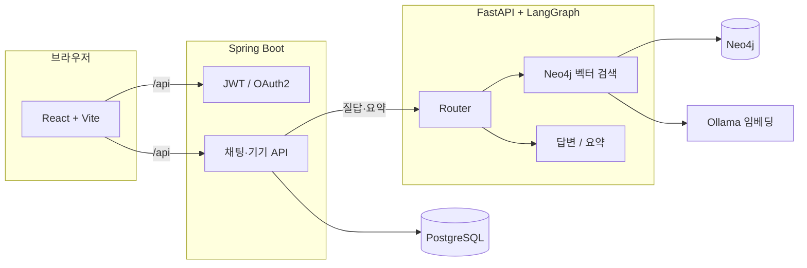

# Fixie

**가전 제품 매뉴얼을 기반으로, 내가 등록한 기기에 대해 AI와 대화하며 쓰는 법·고장·설정을 물어볼 수 있는 웹 서비스입니다.**  
(PDF로부터 추출·구축한 지식 DB 위에 RAG(검색 증강 생성)로 답을 만듭니다.)

이 저장소는 **프론트엔드·API·AI·데이터 파이프라인**이 `em-project/` 아래에 모여 있고, 루트의 [docker-compose.yml](docker-compose.yml)로 인프라와 앱을 한꺼번에 올릴 수 있게 구성되어 있습니다.

---

## 이런 점이 다릅니다

- **채팅으로 매뉴얼 Q&A** — 질문을 보내면 **Neo4j에 적재된 매뉴얼 섹션**을 벡터 검색으로 골라, **LangGraph**로 라우팅·답변·요약을 처리합니다.
- **기기(매뉴얼) 단위 스코프** — DB의 매뉴얼 코드와 AI 쪽 `product_name`이 맞아야 해서, **다른 제품 매뉴얼이 섞이지 않도록** 설계했습니다.
- **역할 분리** — **Spring**은 인증·기기·채팅 기록·비즈니스 API, **FastAPI**는 임베딩·그래프 검색·LLM 파이프라인에 집중합니다.
- **문서化 파이프라인** — PDF → 이미지·OCR·목차(TOC) → **Neo4j** 적재·섹션·임베딩은 `em-project/ai-backend/scripts`에서 이어집니다.

---

## 서비스가 하는 일(한눈에)

- **읽는 사람용 요약**  
  화면에서 보낸 질문은 **Spring**이 기록한 뒤 **AI 서비스**로 전달되고, **Neo4j**에서 관련 매뉴얼 구절을 찾아 답이 생성됩니다. 사용자·기기·채팅은 **PostgreSQL**에 둡니다.

---

## 기술 스택

| 영역 | 사용 |
|------|------|
| 프론트 | React, TypeScript, Vite, Tailwind |
| API | Spring Boot, JPA, Security, WebFlux(`WebClient`) |
| AI | FastAPI, LangGraph, LangChain, Neo4j(벡터), Ollama(bge-m3 등) |
| 데이터 | PostgreSQL, Neo4j |
| 운영 | Docker Compose |

---

## 저장소 구조

| 경로 | 설명 |
|------|------|
| [em-project/frontend](em-project/frontend) | 웹 UI — Vite dev 서버, API는 `/api`로 Spring에 프록시 |
| [em-project/spring-backend](em-project/spring-backend) | REST API, OAuth2·JWT, 기기/채팅, AI 호출 |
| [em-project/ai-backend](em-project/ai-backend) | 채팅·RAG·매뉴얼 정적 이미지 등 |
| [em-project/ai-backend/scripts](em-project/ai-backend/scripts) | PDF 파이프라인·Neo4j 적재 |
| [docker-compose.yml](docker-compose.yml) | Postgres, Neo4j, Ollama, Spring, AI, Frontend 등 |

---

## 처음 오셨다면(짧은 실행 가이드)

1. **Docker**  
   루트에서 `docker compose up -d` — DB·그래프 DB·(선택) 풀스택은 [docker-compose.yml](docker-compose.yml) 주석을 참고하세요.

2. **환경 변수**  
   각 앱의 `.env.example`을 `.env`로 복사해 값을 맞춥니다.  
   - `em-project/spring-backend/.env`  
   - `em-project/ai-backend/.env`  
   - (선택) `em-project/frontend/.env`

3. **Ollama**  
   AI가 임베딩에 **`bge-m3`** 를 씁니다. 로컬 Ollama를 쓰는 경우 모델을 받아 둡니다. Compose를 쓰면 `ollama` 서비스·`--profile setup`으로 `ollama-pull` 예시가 있습니다.

4. **앱만 따로 띄울 때(개발 흐름)**  
   Postgres·Neo4j(·Ollama)를 먼저 띄운 뒤, Spring(8080) → FastAPI(8000) → `frontend`에서 `npm run dev`(3000) 순서를 맞추는 방식이 일반적입니다.

5. **매뉴얼 데이터**  
   질의응답을 쓰려면 Neo4j에 매뉴얼이 적재돼 있어야 하고, Spring의 **매뉴얼 메타**와 **동일한 식별자**가 AI 쪽 필터(`product_name`)와 일치해야 합니다. 덤프·이전은 `dump/` 문서를 참고하세요.

---

## 문서·라이선스

- 데이터베이스 덤프/이전: `dump/`  
- 상세한 포트·CORS·체크리스트는 `docker-compose.yml`과 각 `.env.example`에 정리돼 있습니다.

이 프로젝트에 기여하거나 fork 하기 전에, 위 **저장소 구조**와 **`.env` 예시**를 한 번씩 열어 보시면 전체 맥락이 잡히기 쉽습니다.
