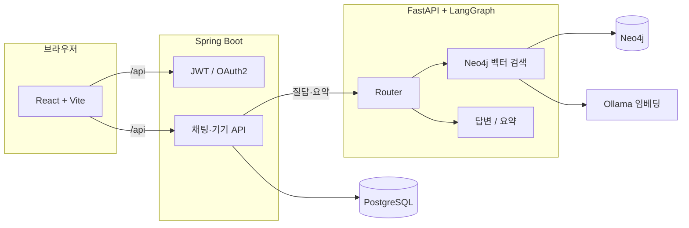

# Fixie

**가전 제품 매뉴얼을 기반으로, 내가 등록한 기기에 대해 AI와 대화하며 쓰는 법·고장·설정을 물어볼 수 있는 웹 서비스입니다.**  
(PDF로부터 추출·구축한 지식 DB 위에 RAG(검색 증강 생성)로 답을 만듭니다.)

이 저장소는 **프론트엔드·API·AI·데이터 파이프라인**이 `em-project/` 아래에 모여 있고, 루트의 [docker-compose.yml](docker-compose.yml)로 인프라와 앱을 한꺼번에 올릴 수 있게 구성되어 있습니다.

---

## 이런 점이 다릅니다

- **채팅으로 매뉴얼 Q&A** — 질문을 보내면 **Neo4j에 적재된 매뉴얼 섹션**을 벡터 검색으로 골라, **LangGraph**로 라우팅·답변·요약을 처리합니다.
- **기기(매뉴얼) 단위 스코프** — DB의 매뉴얼 코드와 AI 쪽 `product_name`이 맞아야 해서, **다른 제품 매뉴얼이 섞이지 않도록** 설계했습니다.
- **역할 분리** — **Spring**은 인증·기기·채팅 기록·비즈니스 API, **FastAPI**는 임베딩·그래프 검색·LLM 파이프라인에 집중합니다.
- **문서化 파이프라인** — PDF → 이미지·OCR·목차(TOC) → **Neo4j** 적재·섹션·임베딩은 `em-project/ai-backend/scripts`에서 이어집니다.

---

## 서비스가 하는 일(한눈에)



- **읽는 사람용 요약**  
  화면에서 보낸 질문은 **Spring**이 기록한 뒤 **AI 서비스**로 전달되고, **Neo4j**에서 관련 매뉴얼 구절을 찾아 답이 생성됩니다. 사용자·기기·채팅은 **PostgreSQL**에 둡니다.

---

## 기술 스택

아래는 이 저장소에서 실제로 쓰는 **언어·런타임·라이브러리·인프라**를 레이어별로 정리한 것입니다. (버전은 `package.json` / `build.gradle` / `requirements.txt` / Compose 이미지 태그를 기준으로 합니다.)

### 프론트엔드 — `em-project/frontend`

| 구분 | 기술 |
|------|------|
| **런타임·언어** | TypeScript 5.8, Node (npm 패키지) |
| **UI 프레임워크** | React 19, React DOM 19 |
| **빌드·개발** | Vite 6, `@vitejs/plugin-react` 5, ES Modules (`"type": "module"`) |
| **스타일** | Tailwind CSS 4, `@tailwindcss/vite`, Autoprefixer |
| **상태·데이터 패칭** | Zustand, TanStack React Query 5 |
| **HTTP** | Axios (인터셉터: JWT, 401/403 처리) |
| **마크다운** | `react-markdown`, `remark-gfm` (채팅 등 본문 렌더) |
| **UX·애니메이션** | Motion (`motion` 패키지) |
| **아이콘** | Lucide React |
| **입력·스키마** | Zod |
| **기타 클라이언트** | `@google/genai` (Google GenAI 연동), `@yudiel/react-qr-scanner` (QR 스캔), `html2canvas`, `jspdf` (캡처·PDF), `dotenv` |

### 백엔드(API) — `em-project/spring-backend`

| 구분 | 기술 |
|------|------|
| **언어·런타임** | Java 17 (Gradle 툴체인) |
| **프레임워크** | Spring Boot 4.0, Spring Web MVC, Spring Data JPA, Spring Security, Spring Validation, Spring Boot AMQP(의존성 포함) |
| **비동기 HTTP 클라이언트** | Spring WebFlux — `WebClient`로 AI(FastAPI) 연동 |
| **영속성** | Hibernate / JPA, **PostgreSQL** JDBC 드라이버 |
| **인증·보안** | JWT (jjwt 0.12.x: api·impl·jackson), **OAuth2 Client** (Google, Kakao) |
| **API 문서** | springdoc OpenAPI 3 (Swagger UI) |
| **기타** | Lombok, Spring Boot Devtools, **ZXing** (QR 코드 생성: core, javase) |
| **빌드** | Gradle (Boot 플러그인, JUnit 5) |

### AI·RAG·데이터 파이프라인 — `em-project/ai-backend`

| 구분 | 기술 |
|------|------|
| **웹** | **FastAPI**, **Uvicorn** (ASGI) |
| **설정·스키마** | Pydantic 2, pydantic-settings, python-dotenv |
| **에이전트·오케스트레이션** | **LangGraph** (StateGraph, Router / Retriever / Answerer / Summarizer / Fallback), **LangChain** 1.2, langchain-ollama, OpenAI·langchain-openai(호환 API·클라이언트 경로) |
| **멀티턴·체크포인트** | `langgraph-checkpoint-postgres`, **psycopg** 3 (binary) — LangGraph State를 **PostgreSQL**에 저장 |
| **그래프·벡터 DB** | **Neo4j** Python Driver 6, Cypher, 벡터 인덱스(`db.index.vector.queryNodes` 등) |
| **임베딩·LLM(로컬)** | **Ollama** HTTP — 임베딩 모델 예: **bge-m3**; Compose 예시에 `gemma4:e4b` 등 |
| **클라우드 LLM** | **Google Generative AI (Gemini 등)** — `GOOGLE_API_KEY` |
| **문서·이미지 파이프라인** | **PyMuPDF**, **OpenCV** (Python), **Pillow** (PDF·페이지 이미지·OCR/TOC 전처리용) |
| **HTTP 유틸** | httpx |
| **테스트** | pytest 8+ |

### 데이터·메시징·인프라

| 구분 | 기술 |
|------|------|
| **관계형 DB** | **PostgreSQL 18** (앱·Spring·LangGraph checkpoint 등) |
| **그래프 DB** | **Neo4j 5** (Bolt, 브라우저 UI) |
| **로컬 모델 런타임** | **Ollama** (Docker 이미지 `ollama/ollama` 또는 호스트 데몬) |
| **컨테이너** | **Docker**, **Docker Compose** — Postgres, Neo4j, Ollama, (선택) Spring·AI·Frontend 멀티 서비스 |
| **빈 값 자동제외(Compose)** | RabbitMQ는 의존성만 있고 `SPRING_AUTOCONFIGURE_EXCLUDE`로 AMQP 자동구성 제외(Compose용) |

### 요약 한 줄

**React 19 + Vite 6 + TS + Tailwind 4** · **Spring Boot 4 + JPA + Security + OAuth2 + JWT + WebClient** · **FastAPI + LangGraph + LangChain + Neo4j + Ollama + (Gemini)** · **PostgreSQL + Neo4j** · **Docker Compose**

---

## 저장소 구조

저장소 루트는 **애플리케이션 코드(`em-project/`)**·**컨테이너 정의**·**DB 이전 문서**로 나뉩니다. 아래는 **의미 있는 소스·설정 위주**입니다(`node_modules`, `.venv`, IDE 설정 등은 생략).

### 루트(`fixie/`)

| 경로 | 역할 |
|------|------|
| [README.md](README.md) | 프로젝트 소개·기술 스택·구조·실행 힌트 |
| [docker-compose.yml](docker-compose.yml) | PostgreSQL, Neo4j, Ollama, Spring, AI, Frontend 등 서비스·볼륨·환경 변수 |
| [dump/](dump/) | DB 덤프를 다른 환경에서 쓰는 방법([Postgres](dump/POSTGRES_덤프_다른환경에서_사용하기.md), [Neo4j](dump/NEO4J_덤프_다른환경에서_사용하기.md)) |
| [em-project/](em-project/) | 프론트·Spring·AI **세 앱** |

---

### `em-project/frontend` — React (Vite)

| 경로 | 설명 |
|------|------|
| [index.html](em-project/frontend/index.html), [vite.config.ts](em-project/frontend/vite.config.ts) | 엔트리, `/api` → Spring·AI **프록시**(`VITE_PROXY_SPRING_ORIGIN`, `VITE_PROXY_AI_ORIGIN`), OAuth용 `X-Forwarded-*` 헤더 |
| [src/main.tsx](em-project/frontend/src/main.tsx), [src/App.tsx](em-project/frontend/src/App.tsx) | 마운트, 전역 내비·채팅 오버레이·스플래시/인증/공유 흐름 |
| [src/api/apiService.ts](em-project/frontend/src/api/apiService.ts) | Axios 인스턴스, JWT 인터셉터, 401/403·**공유 뷰** 예외 |
| [src/services/](em-project/frontend/src/services/) | `authService`, `deviceService`, `chatService`, `guideService` 등 API 모듈 |
| [src/store/](em-project/frontend/src/store/) | Zustand(예: 토스트) |
| [src/types/](em-project/frontend/src/types/), [src/utils/](em-project/frontend/src/utils/) | 공용 타입·유틸(가이드 TOP5·기기 필터 등) |
| [src/constants/data.ts](em-project/frontend/src/constants/data.ts) | 테마·튜토리얼 상수 |
| [src/components/common/](em-project/frontend/src/components/common/) | 로고, 카드, 토스트, 가이드/공유 모달, 디바이스 카드 등 |
| [src/pages/](em-project/frontend/src/pages/) | **화면별** — `Home`, `Garage`, `Chat`(컴포넌트·훅), `History`, `Settings`·`SettingsSubpage`, `Auth`·`OAuthRedirectHandler`·`Signup`·`FindPassword`, `Profile`, `Share`, `Scan`, `SplashScreen`, `TutorialScreen` |
| [src/index.css](em-project/frontend/src/index.css) | 전역 스타일 |

---

### `em-project/spring-backend` — Spring Boot API

| 경로 | 설명 |
|------|------|
| [build.gradle](em-project/spring-backend/build.gradle), [settings.gradle](em-project/spring-backend/settings.gradle) | Gradle, 의존성 |
| [Dockerfile](em-project/spring-backend/Dockerfile) | 컨테이너 이미지 |
| [src/main/resources/application.yaml](em-project/spring-backend/src/main/resources/application.yaml) | 서버·DB·OAuth·JWT·로컬 시드 플래그 |
| [SpringBackendApplication.java](em-project/spring-backend/src/main/java/com/easymanual/springbackend/SpringBackendApplication.java) | 진입점 |
| **global/** | [config](em-project/spring-backend/src/main/java/com/easymanual/springbackend/global/config) — `SecurityConfig`, `WebClientConfig`, `WebMvcConfig`, `JpaConfig`, Swagger 등 · [security](em-project/spring-backend/src/main/java/com/easymanual/springbackend/global/security) — JWT, OAuth2 · [seed](em-project/spring-backend/src/main/java/com/easymanual/springbackend/global/seed) — 로컬 더미 데이터 · [error](em-project/spring-backend/src/main/java/com/easymanual/springbackend/global/error) |
| **domain/user/** | 가입·로그인·프로필·OAuth — `UserController` |
| **domain/device/** | 기기 등록·검색·`UserDevice` — `DeviceController` |
| **domain/manual/** | `Manual`·`Model` |
| **domain/chat/** | 채팅방·메시지·AI 연동 DTO, 가이드 TOP5 — `ChatController`, `GuideStatController` |
| **domain/file/** | 업로드 — `FileController` |
| [uploads/](em-project/spring-backend/uploads/) | 런타임 업로드·**QR 이미지** 등(Compose에서는 볼륨 `spring_uploads`와 연결) |
| [src/test/](em-project/spring-backend/src/test/) | JUnit |

---

### `em-project/ai-backend` — FastAPI·RAG·파이프라인

| 경로 | 설명 |
|------|------|
| [app/main.py](em-project/ai-backend/app/main.py) | FastAPI 앱, `/manual_images` 정적 경로, chat 라우터 |
| [app/api/routes/chat.py](em-project/ai-backend/app/api/routes/chat.py) | `/api/chat/ask`, `/summarize`, `/invoke` — LangGraph 호출 |
| [app/api/http_constants.py](em-project/ai-backend/app/api/http_constants.py) | HTTP 에러 상수 |
| [app/agents/](em-project/ai-backend/app/agents/) | `graph`, `router`, `retriever`, `answerer`, `summarizer`, `fallback`, `state`, `llms` |
| [app/services/](em-project/ai-backend/app/services/) | `pdf_service`, `ocr_service`, `toc_service`, `vectorize_service` 등 |
| [app/config/](em-project/ai-backend/app/config/) | 설정·`.env` 부트스트랩 |
| [app/neo4j_driver.py](em-project/ai-backend/app/neo4j_driver.py) | Neo4j 드라이버 |
| [scripts/](em-project/ai-backend/scripts/) | [run_pipeline.py](em-project/ai-backend/scripts/run_pipeline.py) — 통합 파이프라인 · [ingest_to_neo4j.py](em-project/ai-backend/scripts/ingest_to_neo4j.py), [build_sections.py](em-project/ai-backend/scripts/build_sections.py), [finalize_db.py](em-project/ai-backend/scripts/finalize_db.py), [cleanup_legacy.py](em-project/ai-backend/scripts/cleanup_legacy.py) |
| [data/](em-project/ai-backend/data/) | `raw_pdf`, `processed_images`, `extracted_texts`, `extracted_toc` — **매뉴얼 입·출력**(제품 코드별 하위 폴더) |
| [tests/](em-project/ai-backend/tests/) | pytest(예: `thread_id` 규칙, HTTP 상수) |
| [requirements.txt](em-project/ai-backend/requirements.txt), [Dockerfile](em-project/ai-backend/Dockerfile), `.env.example` | 의존성·이미지·환경 변수 템플릿 |

---

### 요약 트리

```text
fixie/
├── docker-compose.yml
├── dump/                          # Postgres·Neo4j 덤프 이전 가이드
├── README.md
└── em-project/
    ├── frontend/
    │   ├── src/
    │   │   ├── api/              # axios
    │   │   ├── components/       # 공통 UI
    │   │   ├── pages/            # 화면별(Chat 훅·컴포넌트 포함)
    │   │   ├── services/         # API 래퍼
    │   │   ├── store/, types/, utils/
    │   │   ├── App.tsx, main.tsx, index.css
    │   │   └── constants/
    │   ├── vite.config.ts
    │   └── package.json
    ├── spring-backend/
    │   ├── src/main/java/.../    # global + domain (user, device, manual, chat, file)
    │   ├── src/main/resources/
    │   ├── src/test/
    │   ├── uploads/
    │   ├── build.gradle
    │   └── Dockerfile
    └── ai-backend/
        ├── app/                    # main, api, agents, services, config
        ├── scripts/               # PDF → Neo4j 파이프라인
        ├── data/                   # raw_pdf, 이미지·텍스트·목차
        ├── tests/
        ├── requirements.txt
        └── Dockerfile
```

---

## 처음 오셨다면(짧은 실행 가이드)

1. **Docker**  
   루트에서 `docker compose up -d` — DB·그래프 DB·(선택) 풀스택은 [docker-compose.yml](docker-compose.yml) 주석을 참고하세요.

2. **환경 변수**  
   각 앱의 `.env.example`을 `.env`로 복사해 값을 맞춥니다.  
   - `em-project/spring-backend/.env`  
   - `em-project/ai-backend/.env`  
   - (선택) `em-project/frontend/.env`

3. **Ollama**  
   AI가 임베딩에 **`bge-m3`** 를 씁니다. 로컬 Ollama를 쓰는 경우 모델을 받아 둡니다. Compose를 쓰면 `ollama` 서비스·`--profile setup`으로 `ollama-pull` 예시가 있습니다.

4. **앱만 따로 띄울 때(개발 흐름)**  
   Postgres·Neo4j(·Ollama)를 먼저 띄운 뒤, Spring(8080) → FastAPI(8000) → `frontend`에서 `npm run dev`(3000) 순서를 맞추는 방식이 일반적입니다.

5. **매뉴얼 데이터**  
   질의응답을 쓰려면 Neo4j에 매뉴얼이 적재돼 있어야 하고, Spring의 **매뉴얼 메타**와 **동일한 식별자**가 AI 쪽 필터(`product_name`)와 일치해야 합니다. 덤프·이전은 `dump/` 문서를 참고하세요.

---

## 문서·라이선스

- 데이터베이스 덤프/이전: `dump/`  
- 상세한 포트·CORS·체크리스트는 `docker-compose.yml`과 각 `.env.example`에 정리돼 있습니다.

이 프로젝트에 기여하거나 fork 하기 전에, 위 **저장소 구조**와 **`.env` 예시**를 한 번씩 열어 보시면 전체 맥락이 잡히기 쉽습니다.
