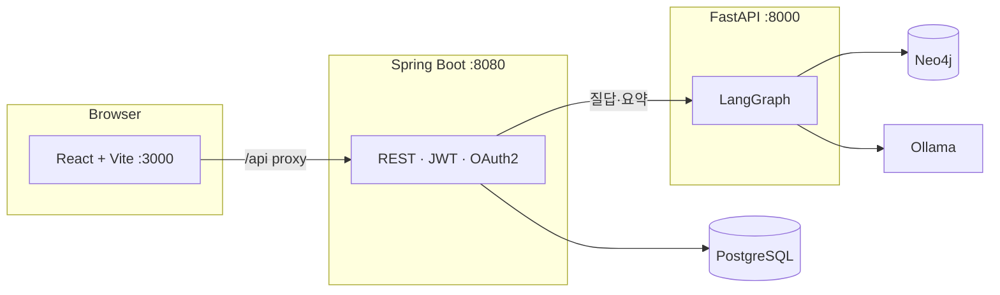

# Fixie (Easy Manual): AI 기반 가전 매뉴얼 Q&A·기기 연동 웹 서비스

## **1. 프로젝트 개요 (Project Overview)**

- **기획 배경**  
  가전 제품은 매뉴얼이 두껍고 검색이 어렵고, “지금 이 기기”에 맞는 답을 찾기까지 시간이 걸립니다. PDF로만 흩어진 설명을 그대로 두면, 사용자는 고객센터·검색·배달 앱 쪽으로 먼저 기대기 쉽습니다.

- **프로젝트 목표**  
  **매뉴얼을 지식 DB(Neo4j + 벡터)로 올리고**, 사용자가 **기기(매뉴얼)를 등록한 뒤** 그 스코프 안에서만 **AI와 채팅**하며 쓰는 법·고장·설정을 물어볼 수 있게 합니다.  
  **Spring Boot**는 인증·기기·채팅 기록·비즈니스 API를, **FastAPI + LangGraph**는 RAG·에이전트·임베딩을 맡깁니다.  
  오프라인으로 **PDF → 이미지·OCR·목차(TOC) → Neo4j 적재·섹션·임베딩** 파이프라인([`em-project/ai-backend/scripts`](em-project/ai-backend/scripts))을 두어, 데이터를 **재현 가능한 절차**로 쌓을 수 있게 합니다.

<br>

## **2. 기술 스택 (Tech Stack)**

- Infra & Run (로컬·컨테이너)

| Category | Detail |
| --- | --- |
| Container | **Docker**, **Docker Compose** ([`docker-compose.yml`](docker-compose.yml)) |
| DB | **PostgreSQL 18** (앱·LangGraph checkpoint 등), **Neo4j 5** (그래프·벡터) |
| LLM/임베딩(로컬) | **Ollama** — 예: 임베딩 `bge-m3`, 답변/Router `gemma4:e4b` 등(Compose·[`ollama-pull`](docker-compose.yml) 주석 참고) |
| 포트(개발 시 흔한 값) | Vite **3000**, Spring **8080**, FastAPI **8000**, Postgres **5432**, Neo4j Bolt **7687** |

<br>

- Backend (Java) — `em-project/spring-backend`

| Category | Detail (Java) |
| --- | --- |
| **Runtime** | **Java 17**, **Spring Boot 4.0** |
| **Web·Data** | Spring Web MVC, Spring Data JPA, Hibernate, **PostgreSQL** JDBC |
| **Security** | Spring Security, **OAuth2** Client (Google, Kakao), **JWT** (jjwt 0.12.x) |
| **AI 연동** | Spring WebFlux **`WebClient`** → FastAPI |
| **API 문서** | **springdoc** OpenAPI (Swagger UI) |
| **Build** | **Gradle** |
| **기타** | Lombok, Bean Validation, **ZXing** (QR), JUnit 5 |

<br>

- AI server (Python) — `em-project/ai-backend`

| Category | Detail (Python) |
| --- | --- |
| **Runtime** | **Python 3** + **FastAPI**, **Uvicorn** |
| **Orchestration** | **LangGraph** (Router → Retriever → Answerer / Summarizer / Fallback) |
| **LangChain 계열(실제 사용)** | `langchain_core` (메시지), **`langchain_ollama`** (ChatOllama, OllamaEmbeddings) |
| **Storage** | **Neo4j** 드라이버, Cypher, 벡터 인덱스; **`langgraph-checkpoint-postgres`** + **psycopg** |
| **문서/파이프라인(오프라인)** | **PyMuPDF** (`fitz`) — PDF·OCR·TOC; 스크립트에서 **Ollama 임베딩**·(선택) **Google Gemini**(`build_sections` 등) |
| **Document** | FastAPI **OpenAPI** (Swagger) |
| **Test** | **pytest** |

<br>

- Frontend (TypeScript) — `em-project/frontend`

| Category | Detail (TypeScript) |
| --- | --- |
| **UI** | **React 19**, **Vite 6**, **Tailwind CSS 4** |
| **HTTP** | **Axios** — JWT·401/403·공유 뷰 예외 ([`apiService.ts`](em-project/frontend/src/api/apiService.ts)) |
| **State** | **Zustand** |
| **콘텐츠** | `react-markdown`, `remark-gfm` |
| **UX** | Motion, Lucide React |
| **기능** | `@yudiel/react-qr-scanner` (QR) |
| **CI/패키지** | **npm** |

<br>

- **의존성에만 있고 런타임에서 쓰지 않거나 미연동인 항목(참고)**  
  삭제 권고가 아니라 **정리·탐구용**입니다.

| 영역 | 항목 | 비고 |
| --- | --- | --- |
| 프론트 | `@tanstack/react-query`, `zod`, `@google/genai`, `html2canvas`, `jspdf`, `dotenv` 등 | `src` import 기준 |
| Spring | `spring-boot-starter-amqp` | RabbitMQ. 코드·Bean 없음, Compose에서 AMQP 자동구성 제외 |
| Python | `openai`, `langchain-openai`, `httpx`, `opencv-python`, `Pillow` 등 | 런타임 에이전트는 Ollama·PyMuPDF 위주. `vectorize_service.py`는 타 모듈에서 미참조 |

- **파이프라인 메모**  
  [`build_sections.py`](em-project/ai-backend/scripts/build_sections.py)는 **`langchain_google_genai`**(Gemini)를 쓰는데, [`requirements.txt`](em-project/ai-backend/requirements.txt)에 **패키지가 없을 수 있어** `langchain-google-genai` 등을 **별도 pip**이 필요한 환경이 있을 수 있습니다.

<br>

## **3. 시스템 아키텍처 & 데이터 흐름 (System Architecture & Data Flow)**

이미지 대신 **다이어그램**으로 요약합니다.

### 3-1. 서비스 데이터 플로우

- 브라우저 **→ Vite(3000)** — `/api` **프록시** **→ Spring(8080)** **→ PostgreSQL** (사용자·기기·채팅·매뉴얼 메타)
- **채팅 질의** 시: **Spring** **→ WebClient** **→ FastAPI(8000)** **→ LangGraph** **→ Neo4j(벡터·그래프) + Ollama(임베딩/소형 LLM)**  
- 매뉴얼 **페이지 이미지**는 AI 서비스가 `data/processed_images`를 **`/manual_images`** 로 제공할 수 있음



### 3-2. 저장소·역할

| 구분 | 경로/구성 | 역할 |
| --- | --- | --- |
| 프론트 | `em-project/frontend` | UI, API 프록시, OAuth용 `X-Forwarded-*` ([`vite.config.ts`](em-project/frontend/vite.config.ts)) |
| API | `em-project/spring-backend` | 인증, 기기, 채팅, 파일, AI 호출 |
| AI | `em-project/ai-backend` | RAG, LangGraph, Neo4j, 체크포인트, 매뉴얼 정적 경로 |
| 파이프라인 | `em-project/ai-backend/scripts` | PDF·적재·섹션·임베딩 |
| 인프라 정의 | [`docker-compose.yml`](docker-compose.yml) | Postgres, Neo4j, Ollama, (선택) 풀스택 |
| DB 이전 가이드 | [`dump/`](dump/) | Postgres / Neo4j 덤프 문서 |

### 3-3. ID 정합 (매뉴얼 스코프)

- Spring `Manual`의 **매뉴얼 코드**와 Neo4j/AI 쪽 **`product_name`(=`manual_id`)**이 **같아야** 제품 간 검색이 섞이지 않습니다.  
- Neo4j 적재·시드·파이프라인 출력 이름을 **한 규칙**으로 맞출 것.

<br>

## **4. 주요 기능 (Key Features)**

### 1. 인증·계정

- 이메일 가입/로그인, **Google·Kakao** OAuth2, JWT
- Vite 뒤에서 OAuth `redirect`가 꼬이지 않게 **Forward 헤더**·`.env`의 redirect URI 정합

### 2. 기기(매뉴얼)와 차고(Garage)

- 모델명 검색으로 **지원 매뉴얼**을 고르고 **UserDevice**로 등록
- **내 기기 목록**·별칭·(소프트) 삭제

### 3. QR·스캔

- **QR 스캔** 화면([`Scan`](em-project/frontend/src/pages/Scan/Scan.tsx)) — 촬영 값을 기기 등록 흐름에 전달

### 4. 매뉴얼 RAG 채팅

- 기기(채팅방) 단위로 질문 **→** Spring이 메시지 저장 **→** FastAPI **LangGraph** (Router·Retriever·Answerer/요약/폴백)
- **벡터 검색** 후 `product_name`으로 **재필터**해 타 매뉴얼 오염 완화

### 5. 히스토리·요약·공유

- 채팅방/메시지 **히스토리**, 대화 **요약** API
- **공유** 링크(쿼리/경로) — 공유 화면에서는 401 시 강제 홈 이동을 막는 처리([`apiService`](em-project/frontend/src/api/apiService.ts))

### 6. 가이드·설정·테마

- **자주 찾는 가이드 TOP5**([`/api/guides/top5`](em-project/spring-backend/src/main/java/com/easymanual/springbackend/domain/chat/controller/GuideStatController.java)) — 제품군별
- 설정·**테마**·프로필·튜토리얼

### 7. 오프라인 데이터 파이프라인

- **PDF** → 이미지·OCR·TOC **→** Neo4j 그래프 **→** 섹션·임베딩·인덱스([`run_pipeline.py`](em-project/ai-backend/scripts/run_pipeline.py) 등)

<br>

## **5. 트러블 슈팅 (Troubleshooting)**

- **LangGraph + Postgres 체크포인트**  
  - 모든 요청이 **같은 `thread_id`** 를 쓰면 이전 `state`가 복원되어 **카운터·상태 누적**이 생길 수 있음.  
  - **해결:** `room_id` 기반 스레드 vs **oneshot** 요청마다 유일 ID 등 [thread_id 규칙](em-project/ai-backend/app/api/routes/chat.py) 및 [회귀 테스트](em-project/ai-backend/tests/test_chat_thread_id.py).

- **Neo4j 벡터만으로는 타 제품 섞임**  
  - **해결:** 쿼리에 `section.product_name = $manual_id` **재필터**, Spring·Neo4j **ID 정합** 유지.

- **OAuth / 리버스 프록시**  
  - Vite(3000) **프록시** 뒤에서 redirect_uri·Host가 달라지는 문제.  
  - **해결:** `application.yaml` **forward-headers**, `.env`의 **`FRONTEND_PUBLIC_URL`**, OAuth 콘솔에 등록한 URI와 **문자 일치**.

- **공유 뷰에서 401**  
  - 전역 인터셉터가 로그인 화면으로 보내면 공유 UX가 깨질 수 있음.  
  - **해결:** `?share=` / `/share/…` **컨텍스트**에서 리다이렉트 생략.

- **`build_sections` / requirements**  
  - `langchain_google_genai` 를 쓰는데 lock에 없으면 **import 오류** — **해결:** `pip install` 로 패키지 보강 또는 requirements 반영.

<br>

## **6. 인프라·로컬 실행 (Docker & Environment)**

- **권장:** 저장소 **루트**에서 `docker compose up -d` — 서비스·볼륨·`depends_on`은 [`docker-compose.yml`](docker-compose.yml) 주석 참고.
- **환경 변수** (각 앱 **`.env.example` → `.env`**)  
  - `em-project/spring-backend/.env` — DB, JWT, OAuth, `AI_BACKEND_URL`  
  - `em-project/ai-backend/.env` — `NEO4J_*`, `POSTGRES_CHECKPOINT_URL`, `GOOGLE_API_KEY`(선택), Ollama URL  
  - (선택) `em-project/frontend/.env` — Vite 프록시 오리진
- **Ollama**  
  - 임베딩 **`bge-m3`** 등. Compose `ollama` + `--profile setup` 의 `ollama-pull` 프로필로 모델 pull 예시.
- **앱만 로컬로 띄울 때**  
  - Postgres·Neo4j(·Ollama) 선기동 **→** Spring(8080) **→** FastAPI(8000) **→** `npm run dev`(3000).
- **체크리스트(요지)**  
  - DB/Neo4j URL·비밀번호가 Compose와 일치하는지, `JWT_SECRET` 길이, **3000/8080/8000** 포트 충돌, CORS(개발은 localhost:3000 중심).

<br>

## **7. 저장소 구조 (Repository layout)**

| 경로 | 역할 |
| --- | --- |
| [`em-project/frontend`](em-project/frontend) | React + Vite — `src/pages`·`services`·`api` |
| [`em-project/spring-backend`](em-project/spring-backend) | `global/`(config, security, seed), `domain/(user, device, manual, chat, file)` |
| [`em-project/ai-backend`](em-project/ai-backend) | `app/`(agents, api, services), `scripts/`, `data/`, `tests/` |
| [`dump/`](dump/) | Postgres / Neo4j 덤프 이전 문서 |
| [`docker-compose.yml`](docker-compose.yml) | 전체 인프라·앱 |

**요약 트리**

```text
fixie/
├── docker-compose.yml
├── dump/
├── README.md
└── em-project/
    ├── frontend/          # Vite, src/ (api, pages, services, …)
    ├── spring-backend/     # Gradle, global + domain, uploads/
    └── ai-backend/         # app/, scripts/, data/, requirements.txt
```

이 저장소는 **One_More_Project** 스타일의 README 구조(개요 → 스택 → 아키텍처 → 기능 → 트러블슈팅 → 인프라)를 따르되, **이미지 없이** Mermaid·표·문장으로만 기술했습니다.
