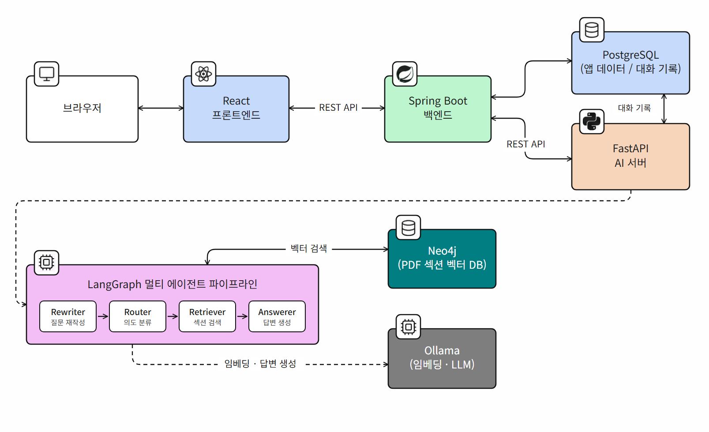

# Fixie (Easy Manual): 제조사 매뉴얼 AI Q&A 시스템

## **1. 프로젝트 개요 (Project Overview)**

- 기획 배경: 가전제품 매뉴얼은 분량이 많고 PDF로 흩어져 있어, 사용자가 “지금 이 기기”에 맞는 답을 찾기까지 시간이 오래 걸립니다. 그 결과 사용자는 매뉴얼 대신 고객센터·검색에 먼저 의존하게 되고, 제조사 입장에서는 동일한 문의가 반복적으로 누적되는 비효율이 발생합니다.
- 프로젝트 목표: 가전제품 매뉴얼 PDF를 **기기 모델 단위로 지식 DB(Neo4j + 벡터)에 적재**하고, 사용자가 등록한 기기의 스코프 안에서만 AI 챗봇이 질의를 처리하도록 합니다. Spring Boot는 사용자·기기·채팅 기록·인증 같은 비즈니스 API를 담당하고, FastAPI + LangGraph는 질문 재작성·의도 분류·RAG 검색·답변 생성과 채팅방 단위 대화 기억을 담당합니다. PDF → 페이지 이미지·텍스트·목차 추출 → 목차 기반 섹션 분할 → 섹션별 비전 분석 → 벡터 임베딩 → Neo4j 적재 파이프라인을 별도 스크립트로 분리해, 매뉴얼 데이터를 **재현 가능한 절차**로 쌓을 수 있게 구성했습니다.

<br>

## **2. 기술 스택 (Tech Stack)**

- Infra & Run (로컬 · 컨테이너)

| Category | Detail |
| --- | --- |
| Container | **Docker**, **Docker Compose** (frontend·spring·ai·postgres·neo4j·ollama 6컨테이너, NVIDIA GPU는 `docker-compose.gpu.yml`로 선택 적용) |
| DB | **PostgreSQL 18** (앱 데이터 + LangGraph 체크포인트), **Neo4j 5** (그래프 + 벡터 검색) |
| LLM / 임베딩 (로컬) | **Ollama** — 임베딩 `bge-m3`, 답변·Router·질문 재작성 `gemma4:e4b` (컨텍스트 16,384) |
| LLM (외부) | **Gemini API** (적재 스크립트의 PDF 페이지 비전 분석) |
| 포트 | Vite **3000**, Spring **8080**, FastAPI **8000**, Postgres **5432**, Neo4j Browser **7474** / Bolt **7687** |

<br>
<br>

- Backend

| Category | Detail (Java) |
| --- | --- |
| **BackEnd** | **Java 17**, **Spring Boot 4.0.5** |
| **Library & API** | **Spring Data JPA**, **Spring Security**, **Spring Web MVC** + **WebFlux**(WebClient로 AI 서버 호출), **OAuth2 Client** (Google · Kakao), **JWT** (jjwt 0.12.5), **ZXing** (QR 코드), Lombok |
| **IDE** | IntelliJ IDEA |
| **Server** | Apache Tomcat (Spring Boot Embedded) |
| **Document** | **Swagger** (SpringDoc OpenAPI) |
| **Build** | **Gradle** |
| **DataBase** | **PostgreSQL 18** |

<br>
<br>

- AI-server

| Category | Detail (Python) |
| --- | --- |
| **BackEnd** | **Python, FastAPI** |
| **Library & API** | **LangChain**, **LangGraph** (Rewriter → Router → Retriever → Answerer, Postgres Checkpoint), **langchain-ollama**, **langchain-google-genai** (적재 스크립트), **PyMuPDF** (PDF 처리), **Neo4j Python Driver** |
| **IDE** | **PyCharm** / VSCode |
| **Server** | **Uvicorn** (FastAPI Server) |
| **Document** | **Swagger UI** (Built-in OpenAPI) |
| **Test** | **pytest** |
| **Build** | **pip** |
| **DataBase** | **Neo4j 5** (벡터 + 그래프), **PostgreSQL 18** (LangGraph Checkpoint) |

<br>
<br>

- Frontend

| Category | Detail (TypeScript) |
| --- | --- |
| **FrontEnd** | **React 19**, **TypeScript 5.8**, **Vite 6** |
| **Library & API** | **TailwindCSS 4**, **Zustand**, **Axios**, **react-markdown** + **remark-gfm**, **@yudiel/react-qr-scanner**, lucide-react, motion |
| **IDE** | **VSCode** |
| **Server** | **Node.js** (Vite Dev Server) |
| **Build** | **npm** |

<br>
<br>

## **3. 시스템 아키텍처 (System Architecture)**

<div align="center">
  
</div>

<br>

- **Frontend (React)** ↔ **Spring Boot 백엔드** : REST API (사용자·기기·채팅·매뉴얼 메타데이터)
  - 이메일 회원가입·로그인, Google · Kakao OAuth2 소셜 로그인 + JWT 인증
- **Spring Boot** ↔ **PostgreSQL** : 사용자·기기·채팅 기록 등 관계형 데이터 저장
- **Spring Boot** → **FastAPI AI 서버** : 채팅 질의를 매뉴얼 코드·채팅방 ID와 함께 위임
  - 질문 저장 → AI 호출 → 답변 저장을 나누어, AI 응답을 기다리는 동안 DB 트랜잭션을 열어 두지 않음
  - 연결 5초·응답 180초 타임아웃. AI 호출이 실패하면 질문은 남기고 실패 안내를 답변으로 저장
- **FastAPI AI 서버** : LangGraph 파이프라인 실행
  - **Rewriter**: 같은 채팅방의 후속 질문("그거 얼마나 자주 해야 돼?")을 최근 대화를 참고해 단독 질문으로 재작성. 방의 첫 질문과 인사는 그대로 통과
  - **Router**: Intent 분류 (hint → 규칙 → LLM 3단계 단락 구조)
  - **Retriever**: Neo4j 벡터 검색 후보 50개 → 사용자 기기의 매뉴얼만 남겨 상위 3개 섹션
  - **Answerer**: 검색된 매뉴얼 섹션 + 최근 대화 3턴으로 답변 생성. 대화는 흐름 이해에만 쓰고 근거는 매뉴얼에서만
- **FastAPI** ↔ **Neo4j** : PDF 매뉴얼 섹션의 임베딩 벡터 검색 + 페이지 관계 조인
- **FastAPI** ↔ **Ollama** : `bge-m3` 임베딩, `gemma4:e4b` 질문 재작성·의도 분류·답변 생성
- **FastAPI** ↔ **PostgreSQL** : LangGraph PostgresSaver로 채팅방(`room-<id>`) 단위 대화 기록 영속화. 체크포인트 테이블은 AI 서버 기동 시 준비
- **PDF 적재 파이프라인 (오프라인 스크립트)** : PDF → 200 DPI 페이지 이미지·텍스트·목차 추출 → 목차 기반 섹션 분할 → 섹션별 Gemini 비전 분석 → bge-m3 임베딩 → Neo4j 적재

<br>
<br>

## **4. 실행 방법 (Docker Compose)**

1. `em-project/spring-backend/.env.example`을 `em-project/spring-backend/.env`로 복사하고 JWT·Google·Kakao OAuth 값을 채웁니다. (Spring은 OAuth 값이 없으면 기동하지 않습니다.)
2. PostgreSQL 데이터 볼륨을 만듭니다(최초 1회).
   ```bash
   docker volume create pixie_postgres_data
   ```
3. 저장소 루트에서 기동합니다.
   ```bash
   # CPU
   docker compose up -d --build
   # NVIDIA GPU (Docker Desktop + WSL2 GPU 지원 드라이버 필요)
   docker compose -f docker-compose.yml -f docker-compose.gpu.yml up -d --build
   ```
4. Ollama 모델을 받습니다(최초 1회).
   ```bash
   docker compose --profile setup run --rm ollama-pull
   ```
5. [5. 데이터 준비](#5-데이터-준비)를 마친 뒤 http://localhost:3000 에 접속합니다.

<br>

## **5. 데이터 준비**

매뉴얼 PDF와 그 추출 결과는 제조사 문서라 저장소에 포함하지 않습니다(`em-project/ai-backend/data`는 git 제외). compose는 이 폴더를 AI 컨테이너의 `/app/data`로 연결합니다.

1. **매뉴얼 메타데이터 (PostgreSQL)** — Spring을 한 번 기동해 테이블이 생긴 뒤 실행합니다. 여러 번 실행해도 중복되지 않습니다. (매뉴얼 3종, 모델 22개)
   ```bash
   docker cp dump/seed_manuals_models_idempotent.sql pixie-postgres:/tmp/seed.sql
   docker exec pixie-postgres psql -U postgres -d pixie -f /tmp/seed.sql
   ```
2. **매뉴얼 본문 (Neo4j)** — PDF를 `em-project/ai-backend/data/raw_pdf/`에 넣고, `em-project/ai-backend/scripts/run_pipeline.py`의 `TARGET_PDF`·`TARGET_MODEL`을 바꿔 실행합니다.
   - `TARGET_MODEL`은 PDF 파일명에서 `.pdf`를 뺀 값이며, 위 SQL의 `manual_code`와 같아야 검색됩니다.
   - 실행 환경에는 Neo4j·Ollama(`bge-m3`) 접속 정보(`em-project/ai-backend/.env.example` 참고)와 Gemini 비전 분석용 `GOOGLE_API_KEY`가 필요합니다.
   - compose는 Ollama 포트를 PC에 열지 않으므로, PC에서 스크립트를 실행할 때는 PC에 설치한 Ollama와 `bge-m3` 모델을 사용합니다.

<br>

## **6. 트러블슈팅**

프로젝트를 마친 뒤 전체 서비스를 Docker로 다시 띄워 점검하면서 아래 문제들을 해결했습니다.

**1) 새 환경에서 첫 질문이 응답 없이 멈추는 문제**
- 원인: AI 서버가 첫 요청 때 LangGraph 체크포인트 테이블을 만들면서 `CREATE INDEX CONCURRENTLY`를 실행하는데, 이 명령은 진행 중인 다른 트랜잭션이 끝나기를 기다립니다. 같은 시점에 Spring은 트랜잭션을 연 채 AI 응답을 기다리고 있어서, 두 서버가 서로를 기다리는 상태가 됐습니다.
- 해결: 체크포인트 준비를 AI 서버 기동 시점으로 옮기고, Spring에서는 AI 호출을 트랜잭션 밖으로 분리했습니다. AI 호출에는 타임아웃(연결 5초, 응답 180초)도 걸었습니다.

**2) 대화가 이어지지 않는 문제**
- 원인: 채팅방 ID가 AI 서버로 전달되지 않아 질문마다 새 대화로 처리됐고, 답변 단계에서도 이전 대화를 참고하지 않았습니다.
- 해결: 채팅방 단위로 대화 기록을 저장했습니다. 그리고 "그거 얼마나 자주 해야 돼?" 같은 후속 질문을 이전 대화를 참고해 완전한 질문으로 바꾼 뒤 검색하는 Rewriter 단계를 추가했습니다.

**3) 답변이 비어서 나오는 문제**
- 원인: Ollama 기본 컨텍스트(4,096 토큰)가 매뉴얼 섹션·질문에 모델의 추론 과정까지 담기에는 부족해서, 답변을 쓰기 전에 한도에 걸렸습니다.
- 해결: 답변 모델의 컨텍스트를 16,384 토큰으로 늘렸습니다.

<br>

## **7. 앞으로 개선할 점**

- 일부 질문에서 정답이 있는 섹션을 찾지 못하는 경우가 있어, 검색 방식을 보완하려 합니다.
- 한 답변에 참고 이미지가 많이 붙는 경우가 있어, 실제로 인용한 페이지만 보여 주도록 바꾸려 합니다.
